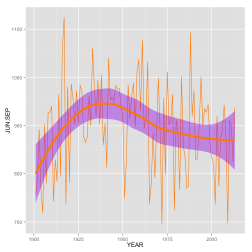

## What is coming

1. Overview - India Rain Fall
2. Shiny Application
3. Monsoon Rainfall Trend
4. Rainfall (1901-2013) JUN-SEP Plot
5. Useful links

--- .class #id 
## Overview - India Rain Fall
  
  "The southwest summer monsoon, a four-month period when massive convective thunderstorms dominate India's weather."
  
1. Monsoon period : June - September
2. What we have - statistical data from 1901 to 2013

---.class #id

## Shiny Application
1. Shiny application  
        https://marikannan.shinyapps.io/ddp_projectwork
2. Interactive data filtering based on year/month
3. Search option
4. Graphical trend : 1901 - 2013

--- .cover #FitToHeight

## Monsoon Rainfall Trend ( its live)
<iframe src = 'https://marikannan.shinyapps.io/ddp_projectwork' height='600px' width='1000px'></iframe>

---.class #id

## Rainfall (1901-2013) JUN-SEP ( r code executed)


```r
library(ggplot2)
rainData <- read.csv("data/india_rainfall.csv",header=TRUE)
p <- ggplot(rainData, aes(YEAR, JUN.SEP))+geom_line(color="darkorange")
p + geom_smooth(fill="purple",color="darkorange",size=2)
```

 

---

## Useful links
*  http://marikannan.github.io/coursera_ddp_slidify/
*  https://marikannan.shinyapps.io/ddp_projectwork
*  https://github.com/marikannan/coursera_ddp_projectwork
*  http://www.imd.gov.in/section/nhac/dynamic/data.htm


